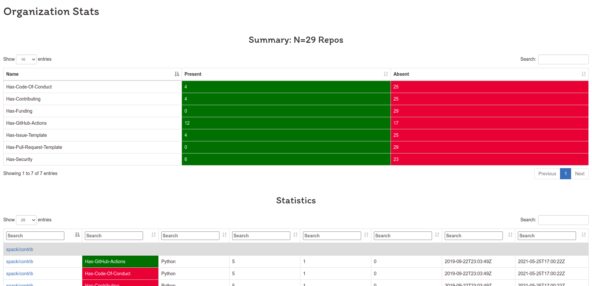

# Code Stats

This is a small project that will allow for easily calculating stats for all
repos across an organization, or a single repository of interest. Other metrics
could be added for other entities beyond repository health too!




## Usage

To build the library:

```bash
$ make
```

This will compile an executable, `codestats` that you can interact with.

## Commands

### Repository Stats

```bash
$ ./codestats repo buildsi/build-abi-containers
```

You can also save to file:

```bash
$ ./codestats repo buildsi/build-abi-containers --outfile examples/repo.json
```

You can also pretty print json:

```bash
$ go run main.go repo buildsi/build-abi-containers --pretty
build-abi-containers

[
    {
        "Stats": [
            {
                "Name": "Has-Codeowners",
                "Pass": false
            },
            {
                "Name": "Has-Maintainers",
                "Pass": false
            },
            {
                "Name": "Has-GitHub-Actions",
                "Pass": true
            },
            {
                "Name": "Has-CircleCI",
                "Pass": false
            },
            {
                "Name": "Has-Travis",
                "Pass": false
            },
            {
                "Name": "Has-PullApprove",
                "Pass": false
            },
            {
                "Name": "Has-Glide",
                "Pass": false
            },
            {
                "Name": "Has-Code-Of-Conduct",
                "Pass": false
            },
            {
                "Name": "Has-Contributing",
                "Pass": false
            },
            {
                "Name": "Has-Authors",
                "Pass": false
            },
            {
                "Name": "Has-Pull-Request-Template",
                "Pass": false
            },
            {
                "Name": "Has-Issue-Template",
                "Pass": false
            },
            {
                "Name": "Has-Support.md",
                "Pass": false
            },
            {
                "Name": "Has-Funding",
                "Pass": false
            },
            {
                "Name": "Has-Security",
                "Pass": false
            }
        ],
        "Name": "buildsi/build-abi-containers",
        "Branch": "main",
        "Url": "https://github.com/buildsi/build-abi-containers",
        "Stars": 2,
        "Forks": 1,
        "Issues": 3,
        "Language": "Python",
        "Archived": false,
        "CreatedAt": "2021-05-23T20:02:51Z",
        "UpdatedAt": "2021-10-16T12:37:19Z"
    }
]
```


### Organization Stats

If you want to get stats for an org:

```bash
$ ./codestats org buildsi

build-notes
build-si-modeling
Smeagle
build-abi-tests
build-abi-containers
build-sandbox
...
```

You can also add an optional skip pattern to say - "Don't parse repos that match this regular expression!"

```bash
$ go run main.go org spack --skip spack-search --output example/spack.json
```

You can also add an optional pattern to only parse a subset of repos, or add `--pretty` to pretty print the json.

```bash
$ go run main.go org buildsi --pattern build-abi-containers --pretty
build-abi-containers
build-abi-containers-results
{
        {
            "Stats": [
                {
                    "Name": "Has-Codeowners",
                    "Pass": false
                },
                {
                    "Name": "Has-Maintainers",
                    "Pass": false
                },
                {
                    "Name": "Has-GitHub-Actions",
                    "Pass": true
                },
                {
                    "Name": "Has-CircleCI",
                    "Pass": false
                },
                {
                    "Name": "Has-Travis",
                    "Pass": false
                },
                {
                    "Name": "Has-PullApprove",
                    "Pass": false
                },
                {
                    "Name": "Has-Glide",
                    "Pass": false
                }
            ],
            "Name": "buildsi/build-abi-containers",
            "Branch": "main",
            "Url": "https://github.com/buildsi/build-abi-containers",
            "Stars": 2,
            "Forks": 1,
            "Issues": 3,
            "Language": "Python",
            "Archived": false,
            "CreatedAt": "2021-05-23T20:02:51Z",
            "UpdatedAt": "2021-10-16T12:37:19Z"
        },
        {
            "Stats": [
                {
                    "Name": "Has-Codeowners",
                    "Pass": false
                },
                {
                    "Name": "Has-Maintainers",
                    "Pass": false
                },
                {
                    "Name": "Has-GitHub-Actions",
                    "Pass": true
                },
                {
                    "Name": "Has-CircleCI",
                    "Pass": false
                },
                {
                    "Name": "Has-Travis",
                    "Pass": false
                },
                {
                    "Name": "Has-PullApprove",
                    "Pass": false
                },
                {
                    "Name": "Has-Glide",
                    "Pass": false
                }
            ],
            "Name": "buildsi/build-abi-containers-results",
            "Branch": "main",
            "Url": "https://github.com/buildsi/build-abi-containers-results",
            "Stars": 1,
            "Forks": 0,
            "Issues": 0,
            "Language": "Python",
            "Archived": false,
            "CreatedAt": "2021-06-08T23:44:24Z",
            "UpdatedAt": "2021-08-29T14:25:50Z"
        }
}
```

or again, save to output file:

```bash
$ go run main.go org buildsi --outfile examples/org.json
```

The output file is the same format, so you can use the same visualization code in [docs](docs) for a web interface.

### Customize Stats

For either the org or repo command, you can provide an optional yaml file
to define a list of stats you want:

```bash
$ go run main.go repo buildsi/build-abi-containers --config examples/all-stats.yaml 
```

There is also an example file with known [GitHub health stats](https://docs.github.com/en/communities/setting-up-your-project-for-healthy-contributions/creating-a-default-community-health-file)

```bash
$ go run main.go repo buildsi/build-abi-containers --config examples/health-stats.yaml
```

Or save to output file, perhaps for a web interface!

```bash
$ go run main.go org buildsi --outfile examples/data.json 
```

And finally, if you don't want to use a config file and want a quick run of one or more metrics, ask for them on the fly with `--metric`

```bash
$ go run main.go repo spack/spack --metric has-code-of-conduct
$ go run main.go repo spack/spack --metric has-code-of-conduct,has-funding
```

### Web Interface

When you generate stats, you can put them in the same directory as the provided [docs](docs)
to generate a nice interface, which will be organized by type and repository.
You can see an example at [https://vsoch.github.io/codestats](https://vsoch.github.io/codestats)

### GitHub Action

The repository also serves a GitHub action! You can run extractions with the same variables, for either
an organization or a repository.

```yaml
name: Codestats Test
on:
  pull_request: []
  push:
    branches:
      - main 
 
jobs:
  extract-repo:
    runs-on: ubuntu-latest
    name: Repository Stats
    steps:
      - name: Checkout
        uses: actions/checkout@v2
      - name: Codestats for a repository
        uses: vsoch/codestats@main
        with:
          repository: spack/spack
          metric: has-code-of-conduct
          outfile: spack.json
      - name: View Outfile
        run: cat spack.json

  extract-org:
    runs-on: ubuntu-latest
    name: Org Stats
    steps:
      - name: Checkout
        uses: actions/checkout@v2
      - name: Codestats for an organization
        uses: vsoch/codestats@main
        with:
          org: spack
          metric: has-code-of-conduct
          pattern: spack-tutorial
          outfile: spack-tutorial.json
      - name: View Outfile
        run: cat spack-tutorial.json
```

The above is a basic example, for each of a repository and an org, and you can
see variables in the [action.yml](action.yml). Please don't hesitate to open an issue
to ask a question or request better documentation.

### Questions?

So what else would you like to see? Additional stats or interface support? Please [open an issue](https://github.com/vsoch/codestats/issues) and let me know!

### TODO

 - IDEA: should there be a common format for a stat, beyond hard coding? E.g., most seem like checking if something exists - this could be YAML


## Previous Art

This was inspired by [bloodorange/oci-stats](https://github.com/bloodorangeio/oci-stats/blob/main/gen-html-for-repo.sh)!
